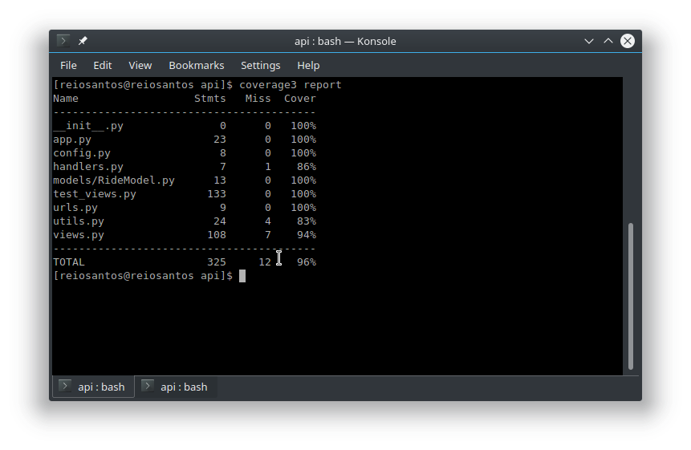

# Ride-my-way

Ride-my App is a carpooling application that provides drivers with the ability to create ride offers and passengers to join available ride offers.

==API==

***Features***

 * Users ==(Driver and pasenger)== can fetch all ride offers
 * Users c can fetch a specific ride offer
 * Driver creates a ride offer
 * Passengers make a request to join a ride.
 * Driver can deletes and update ride offer

## coverage badge

Travis Build Status

## coverage report

